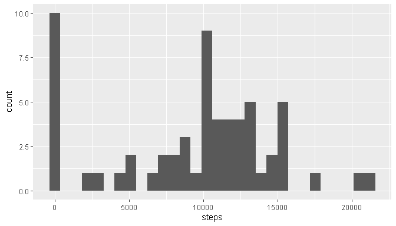
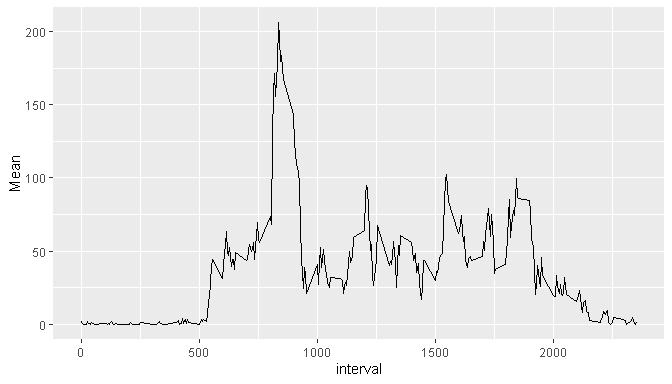
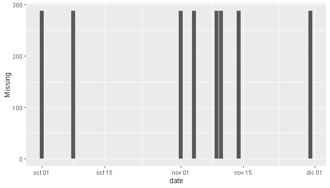
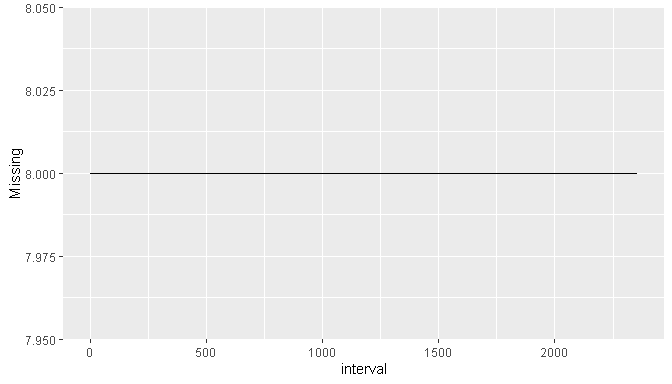
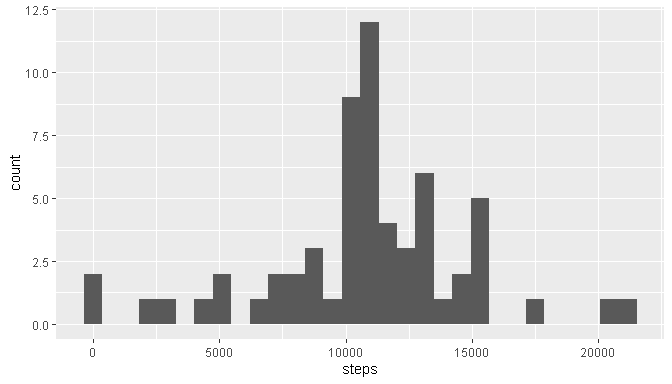
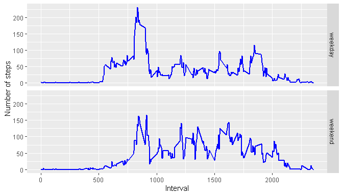

## Loading and preprocessing the data
As a first step, we proceed to read in the data. It is a csv file:


```r
if (!file.exists('activity.csv')) {unzip ('activity.zip')}
activity <- read.csv('activity.csv')

#Convert date column to correct format
library(lubridate)
```

```
## 
## Attaching package: 'lubridate'
```

```
## The following objects are masked from 'package:base':
## 
##     date, intersect, setdiff, union
```

```r
activity$date <-ymd(activity$date)
```


## What is mean total number of steps taken per day?
In this part of the assignment the missing values were ignored.
Firstly, the total number of steps taken per day were calculated:


```r
sum(activity$steps, na.rm = TRUE)
```

```
## [1] 570608
```

Secondly, a histogram of the total number of steps taken each day was done.


```r
library(ggplot2)
library(dplyr)
```

```
## 
## Attaching package: 'dplyr'
```

```
## The following objects are masked from 'package:stats':
## 
##     filter, lag
```

```
## The following objects are masked from 'package:base':
## 
##     intersect, setdiff, setequal, union
```

```r
steps_per_day <- activity %>% group_by(date) %>%
  summarize(steps = sum(steps, na.rm = TRUE))
```

```
## `summarise()` ungrouping output (override with `.groups` argument)
```

```r
steps_per_day %>% ggplot(aes(steps)) + geom_histogram()
```

```
## `stat_bin()` using `bins = 30`. Pick better value with `binwidth`.
```

<!-- -->

The following table shows the mean and median of the total number of steps each day


```r
stats <- activity %>% group_by(date) %>%
  summarize(Mean = mean(steps, na.rm = TRUE), Median = median(steps, na.rm = TRUE))
```

```
## `summarise()` ungrouping output (override with `.groups` argument)
```

```r
stats
```

```
## # A tibble: 61 x 3
##    date          Mean Median
##    <date>       <dbl>  <dbl>
##  1 2012-10-01 NaN         NA
##  2 2012-10-02   0.438      0
##  3 2012-10-03  39.4        0
##  4 2012-10-04  42.1        0
##  5 2012-10-05  46.2        0
##  6 2012-10-06  53.5        0
##  7 2012-10-07  38.2        0
##  8 2012-10-08 NaN         NA
##  9 2012-10-09  44.5        0
## 10 2012-10-10  34.4        0
## # ... with 51 more rows
```


## What is the average daily activity pattern?
Time series plot of the 5-minute interval and the average number of steps taken averaged across all days


```r
average_steps_per_interval <- activity %>% group_by(interval) %>%
  summarize(Mean = mean(steps, na.rm = TRUE))
```

```
## `summarise()` ungrouping output (override with `.groups` argument)
```

```r
average_steps_per_interval %>% ggplot(aes(interval, Mean)) +
  geom_line()
```

<!-- -->

Interval with maximum number of steps


```r
average_steps_per_interval$interval[which.max(average_steps_per_interval$Mean)]
```

```
## [1] 835
```

## Imputing missing values
Total number of missing values

```r
sum(is.na(activity$steps))
```

```
## [1] 2304
```

We now proceed with imputing values to NAs. The first step is to see how NAs are distributed.


```r
nas <- activity %>% filter(is.na(steps))
activity %>% group_by(date) %>% summarise(Missing = sum(is.na(steps))) %>%
  ggplot(aes(date,Missing)) + geom_bar(stat = 'identity') #checking to see amount of missing values per day
```

```
## `summarise()` ungrouping output (override with `.groups` argument)
```

<!-- -->

```r
activity %>% group_by(interval) %>% summarise(Missing = sum(is.na(steps))) %>%
  ggplot(aes(interval,Missing)) + geom_line() #checking to see amount of missing values per interval
```

```
## `summarise()` ungrouping output (override with `.groups` argument)
```

<!-- -->

```r
imputed_values <- nas %>% mutate(steps = rep(average_steps_per_interval$Mean,8))
```
From the first plot, we see that there are 288 values missing per day in exactly 8 days (total number of values in a day is 288).
From the second plot, we see that there are 8 values missing per interval.

Upon this knowledge, the method chosen to impute values in the NAs is to use the mean of the interval in which the value is going to be imputed. This is done through a for loop. We first create the new dataset and then impute values:


```r
activity_2 <- activity
j <- 1
for (i in 1:length(activity_2$steps)) {
  if (is.na(activity_2$steps[i])) {
    activity_2$steps[i] = imputed_values$steps[j]
    j <- j+1
    }
}
```

We finally create a histogram with the new dataset and observe that it has changed compared to the first histogram which ignored NAs.


```r
steps_per_day_2 <- activity_2 %>% group_by(date) %>%
  summarize(steps = sum(steps, na.rm = TRUE))
```

```
## `summarise()` ungrouping output (override with `.groups` argument)
```

```r
steps_per_day_2 %>% ggplot(aes(steps)) + geom_histogram()
```

```
## `stat_bin()` using `bins = 30`. Pick better value with `binwidth`.
```

<!-- -->

The new mean and median are also reported for each date.


```r
stats_2 <- activity_2 %>% group_by(date) %>%
  summarize(Mean = mean(steps, na.rm = TRUE), Median = median(steps, na.rm = TRUE))
```

```
## `summarise()` ungrouping output (override with `.groups` argument)
```

```r
stats_2
```

```
## # A tibble: 61 x 3
##    date         Mean Median
##    <date>      <dbl>  <dbl>
##  1 2012-10-01 37.4     34.1
##  2 2012-10-02  0.438    0  
##  3 2012-10-03 39.4      0  
##  4 2012-10-04 42.1      0  
##  5 2012-10-05 46.2      0  
##  6 2012-10-06 53.5      0  
##  7 2012-10-07 38.2      0  
##  8 2012-10-08 37.4     34.1
##  9 2012-10-09 44.5      0  
## 10 2012-10-10 34.4      0  
## # ... with 51 more rows
```

## Are there differences in activity patterns between weekdays and weekends?
A new factor variable is created which differentiates between weekdays and weekends.


```r
activity_2$day <- weekdays(activity$date)
activity_2 <- activity_2 %>% mutate(day = case_when(
  day %in% c('lunes','martes','miércoles','jueves','viernes') ~ 'weekday',
  day %in% c('sábado', 'domingo') ~ 'weekend'))
activity_2$day <- factor(activity_2$day)
```

Finally a panel plot is made to compare the average number of steps per interval between weekdays and weekends.


```r
mean_steps_per_interval <- activity_2 %>% group_by(interval,day) %>% summarise(Mean = mean(steps))
```

```
## `summarise()` regrouping output by 'interval' (override with `.groups` argument)
```

```r
mean_steps_per_interval %>% ggplot(aes(interval, Mean)) + geom_line(lwd=1,col='blue') + 
facet_grid(day~.) + 
xlab('Interval') + ylab('Number of steps')
```

<!-- -->
